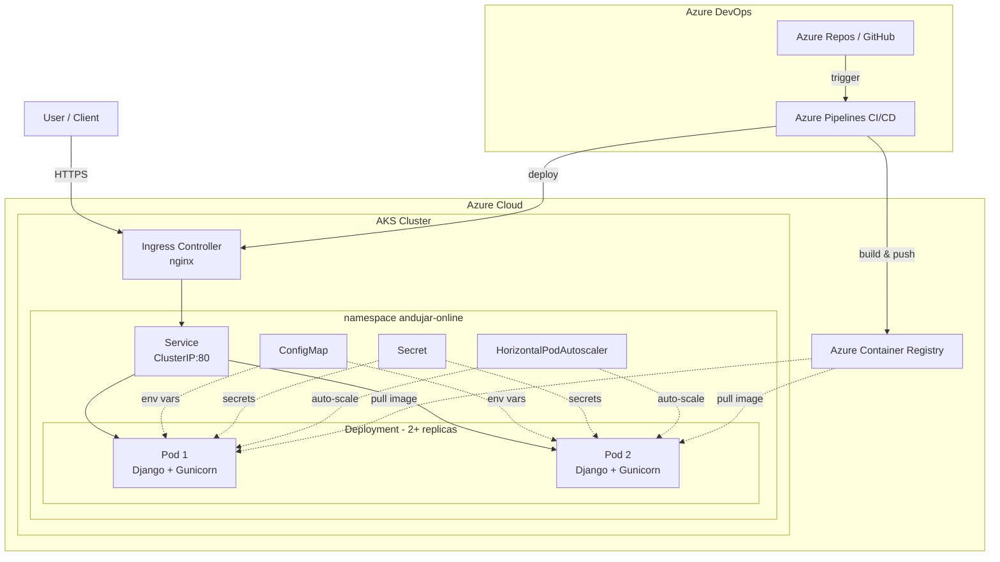

# Andujar Online — Azure IaC Platform

Enterprise-grade Infrastructure as Code (IaC) for a production REST API built with Django, containerized with Docker, orchestrated with Kubernetes on Azure AKS, automated with Azure DevOps CI/CD, and provisioned with Terraform.

---

## Table of Contents

- [Architecture](#architecture)
- [Application](#application)
- [Local Development](#local-development)
- [Docker](#docker)
- [CI/CD Pipeline (Azure DevOps)](#cicd-pipeline-azure-devops)
- [Kubernetes Deployment](#kubernetes-deployment)
- [Infrastructure as Code (Terraform)](#infrastructure-as-code-terraform)
- [Design Decisions](#design-decisions)
- [Production Considerations](#production-considerations)

---

## Architecture

### High-Level Architecture



### CI/CD Pipeline Flow


---

## Application

REST API built with **Django 4.2** + **Django REST Framework 3.14**, using SQLite.

### API Endpoints

| Endpoint | Method | Description |
|---|---|---|
| `/api/users/` | GET | List all users |
| `/api/users/` | POST | Create a user (`{"dni": "...", "name": "..."}`) |
| `/api/users/<id>/` | GET | Get user by ID |
| `/health/` | GET | Health check (K8s probes) |
| `/admin/` | GET | Django admin panel |

---

## Local Development

### Prerequisites

- Python 3.11+
- Docker (for containerized execution)
- Azure CLI + kubectl + Terraform (for cloud deployment)

### Run the Application

```bash
# Create virtual environment
python -m venv .venv
source .venv/bin/activate

# Install dependencies
pip install -r requirements-dev.txt

# Run migrations
python manage.py migrate

# Run the application
python manage.py runserver

# Open: http://localhost:8000/api/
```

### Run Tests

```bash
# Run unit tests
python manage.py test --verbosity=2

# Run with coverage
coverage run manage.py test
coverage report
coverage html && open htmlcov/index.html
```

### Lint

```bash
# Static analysis
ruff check api/ demo/

# Format check
ruff format --check api/ demo/
```

---

## Docker

### Build and Run

```bash
# Build
docker build -t andujar-online-api:latest .

# Run
docker run -d --name andujar-online -p 8000:8000 \
  -e DJANGO_SECRET_KEY="your-secret-key" \
  andujar-online-api:latest

# Test
curl http://localhost:8000/health/
curl http://localhost:8000/api/users/
```

### Dockerfile Features

| Feature | Detail |
|---|---|
| Multi-stage build | Smaller production image (~150MB) |
| Gunicorn | Production WSGI server (3 workers) |
| Non-root user | `appuser` for security |
| Health check | Built-in `HEALTHCHECK` on `/health/` |
| Static files | `collectstatic` during build |
| Migrations | Applied during build for SQLite |

---

## CI/CD Pipeline (Azure DevOps)

The pipeline is defined in `azure-pipelines.yml`.

### Pipeline Stages

| Stage | Tools | Purpose |
|---|---|---|
| **Build & Test** | pip, ruff, coverage | Install deps, lint, test, coverage report |
| **Docker** | Docker, ACR, Trivy | Build image, push to ACR, vulnerability scan |
| **Deploy** | KubernetesManifest | Apply K8s manifests to AKS |

### Azure DevOps Setup

1. **Create an Azure DevOps project** and import/link your GitHub repository
2. **Create a Service Connection** to Azure (Settings → Service connections → Azure Resource Manager)
3. **Update `azure-pipelines.yml`** with your variables:
   ```yaml
   azureSubscription: 'your-service-connection-name'
   acrName: 'youracrname'
   aksResourceGroup: 'your-rg-name'
   aksClusterName: 'your-aks-name'
   ```
4. **Create a pipeline** pointing to `azure-pipelines.yml`

---

## Kubernetes Deployment

### Manifests

| File | Resource | Description |
|---|---|---|
| `namespace.yml` | Namespace | `andujar-online` namespace |
| `configmap.yml` | ConfigMap | DEBUG, ALLOWED_HOSTS, DATABASE_NAME |
| `secret.yml` | Secret | DJANGO_SECRET_KEY (base64) |
| `deployment.yml` | Deployment | 2 replicas, probes, resource limits, rolling update |
| `service.yml` | Service | ClusterIP:80 → container:8000 |
| `ingress.yml` | Ingress | nginx Ingress with domain-based routing |
| `hpa.yml` | HPA | 2–5 replicas, CPU/memory autoscaling |

### Manual Deployment to AKS

```bash
# Get AKS credentials
az aks get-credentials --resource-group andujar-online-rg --name andujar-online-aks

# Apply all manifests
kubectl apply -f k8s/namespace.yml
kubectl apply -f k8s/configmap.yml
kubectl apply -f k8s/secret.yml
kubectl apply -f k8s/deployment.yml
kubectl apply -f k8s/service.yml
kubectl apply -f k8s/ingress.yml
kubectl apply -f k8s/hpa.yml

# Verify
kubectl get all -n andujar-online
kubectl get hpa -n andujar-online
```

### Local Testing (Minikube)

```bash
minikube start
minikube addons enable ingress
minikube addons enable metrics-server

eval $(minikube docker-env)
docker build -t andujar-online-api:latest .

# Update deployment.yml: imagePullPolicy: Never
kubectl apply -f k8s/

kubectl port-forward -n andujar-online svc/andujar-online-api 8000:80
curl http://localhost:8000/health/
```

---

## Infrastructure as Code (Terraform)

The `terraform/` directory provisions all infrastructure on Azure.

### Resources Created

| Resource | Purpose |
|---|---|
| Resource Group | Container for all Azure resources |
| Azure Container Registry | Docker image storage |
| AKS Cluster | Kubernetes cluster with autoscaling nodes |
| Role Assignment | AcrPull — allows AKS to pull images from ACR |

### Usage

```bash
cd terraform
cp terraform.tfvars.example terraform.tfvars
# Edit terraform.tfvars with your values

az login
terraform init
terraform plan
terraform apply

# Configure kubectl
az aks get-credentials --resource-group andujar-online-rg --name andujar-online-aks

# When done:
terraform destroy
```

---

## Design Decisions

| Decision | Rationale |
|---|---|
| **Django** | Robust framework with native support for REST API, ORM, and admin panel |
| **Gunicorn** | Production WSGI server, replaces Django's development server |
| **Azure DevOps** | Native integration with AKS/ACR via managed identity |
| **Azure ACR** | Tight AKS integration via managed identity (AcrPull) |
| **Multi-stage Docker** | Smaller image, only production dependencies in the final stage |
| **2 replicas + HPA** | High availability requirement; autoscales 2→5 under load |
| **Rolling update** | Zero-downtime deployments (`maxUnavailable: 0`) |
| **Non-root container** | Security best practice at Docker and K8s level |
| **Health endpoint** | `/health/` added for K8s liveness/readiness/startup probes |
| **Terraform for Azure** | Reproducible, versioned, and auditable infrastructure as code |
| **Standard_B2s nodes** | Cost-efficient in production; burstable performance |

---

## Production Considerations

| Area | Recommendation |
|---|---|
| **TLS/SSL** | Use cert-manager + Let's Encrypt on AKS |
| **DNS** | Point custom domain to the AKS Ingress external IP |
| **Secrets** | Use Azure Key Vault with CSI driver instead of K8s secrets |
| **Database** | Replace SQLite with Azure Database for PostgreSQL |
| **Monitoring** | Azure Monitor + Container Insights for metrics and logs |
| **Backup** | Velero for cluster backup |
| **Network Policies** | Restrict pod-to-pod traffic with Calico/Azure NPM |
| **RBAC** | Azure AD integration for granular K8s access control |
| **Pod Disruption Budget** | Ensure availability during node upgrades |

---

## Project Structure

```
.
├── azure-pipelines.yml        # Azure DevOps CI/CD pipeline
├── api/                       # Django REST Framework application
│   ├── models.py              # User model
│   ├── views.py               # ViewSet + health check
│   ├── serializers.py         # User serializer
│   ├── urls.py                # API routing
│   ├── tests.py               # Unit tests (11 tests)
│   ├── admin.py               # Admin registration
│   └── migrations/            # Database migrations
├── demo/                      # Django project configuration
│   ├── settings.py            # Settings (env-configurable)
│   ├── urls.py                # Root URLs + health
│   ├── wsgi.py                # WSGI configuration
│   └── asgi.py                # ASGI configuration
├── k8s/                       # Kubernetes manifests
│   ├── namespace.yml
│   ├── configmap.yml
│   ├── secret.yml
│   ├── deployment.yml         # 2+ replicas, probes
│   ├── service.yml
│   ├── ingress.yml
│   └── hpa.yml                # Autoscaling
├── terraform/                 # Azure IaC (Terraform)
│   ├── main.tf                # RG, ACR, AKS
│   ├── variables.tf
│   ├── outputs.tf
│   └── terraform.tfvars.example
├── Dockerfile                 # Multi-stage, Gunicorn
├── .dockerignore
├── .gitignore
├── manage.py
├── requirements.txt           # Production dependencies
├── requirements-dev.txt       # Dev/test dependencies
├── pyproject.toml             # Ruff + coverage configuration
└── README.md
```

---

## License

Copyright © 2026 Andujar Online. All rights reserved.
